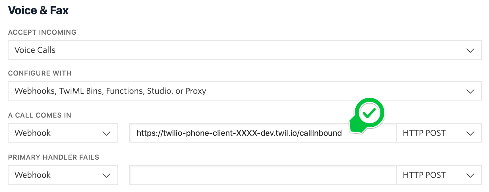

# Twilio Phone Client

## Table of contents

- [Introduction](#introduction)
  - [Notable features](#notable-features)
- [Installation](#installation)
- [Roadmap](#roadmap)
- [Screenshots](#screenshots)
  - [SMS](#sms)
  - [Call](#call)

## Introduction

This is a web client providing easy access to SMS and call capabilities of a Twilio phone number.

The SMS part is built on top of Twilio's [Programmable Chat API](https://www.twilio.com/docs/chat).

This repository consists of two parts:

```
/src/               # the frontend React app
/deploy/functions/  # supporting backend scripts, to be deployed as Twilio Functions
```

The npm `deploy` command utilizes [Twilio CLI](https://www.twilio.com/docs/twilio-cli/quickstart) to deploy both the frontend and backend to [Twilio Runtime](https://www.twilio.com/docs/runtime/functions-assets-api).

### Notable features

- SMS: Infitinty scolling (older messages get loaded automatically as one scrolls up in a thread)
- SMS: Hovering over message timestamp displays tooltip with additional details of each message including its [SID](https://www.twilio.com/docs/glossary/what-is-a-sid)
- SMS: Unread message count tracking
- Call: Support for both inbound and outbound calls
- Configurable accent color (see `REACT_APP_ACCENT_COLOR` in `/.env`)

## Installation

Before you start, make sure you have [Twilio CLI](https://www.twilio.com/docs/twilio-cli/quickstart) and its [serverless plugin](https://www.twilio.com/docs/twilio-cli/plugins#available-plugins) installed and working.

Then there are couple things that need to be prepared before the installation:

1. Note down your [Account SID](https://www.twilio.com/console)
2. Create and note down [API key & secret](https://www.twilio.com/console/project/api-keys)
3. Create a [Programmable Chat Service](https://www.twilio.com/console/chat/services) and note down its SID

Now clone this repository:

```
$ git clone https://github.com/jandusek/twilio-phone-client.git
$ cd twilio-phone-client/
```

And install dependencies and deploy it to your Functions for the first time:

```
$ npm install                    # install React dependencies
$ cd deploy; npm install; cd ..  # install Twilio Runtime dependencies
$ npm run deploy                 # test deploy your application to get its public URLs
...
Functions:
   [protected] https://twilio-phone-client-XXXX-dev.twil.io/callInbound  <<< note down the /callInbound URL
   [protected] https://twilio-phone-client-XXXX-dev.twil.io/callOutbound <<< note down the /callOutbound URL
   [protected] https://twilio-phone-client-XXXX-dev.twil.io/msgInbound   <<< note down the /msgInbound URL
   https://twilio-phone-client-XXXX-dev.twil.io/getAccessToken
   https://twilio-phone-client-XXXX-dev.twil.io/msgOutbound

```

Your phone client will **not work** at this point.

4. Purchase a [Twilio phone number](https://www.twilio.com/console/phone-numbers/incoming) and note it down (if you plan to use both SMS and calls, make sure your phone number has both capabilities).

In the phone number's configuration, set the "A Call Comes In" Webhook to the `/callInbound` URL you have collected above.



Then set the "A Message Comes In" Webhook to the `/msgInbound` URL you have collected above.


After you hit the Save button, both webhooks will update to a Function, that is expected.

5. Create a new [TwiML App](https://www.twilio.com/console/voice/twiml/apps) and set its Voice Request URL to the `/callOutbound` URL you have noted in the previous step. Save it and then go back to the TwiML App's configuration and note down its SID.


6. Save the collected information and deploy

```
$ cp deploy/.env.sample deploy/.env
$ vim deploy/.env   # fill in information collected in the previous steps
ACCOUNT_SID=ACxxx
API_KEY=SKxxx
API_SECRET=xxx
CHAT_SERVICE_SID=ISxxx
TWILIO_NUMBER=+1xxx
TWIML_APP_SID=APxxx
SECRET=some_password

$ npm run deploy    # deploy your application for the 2nd time
...
Assets:
   https://twilio-phone-client-XXXX-dev.twil.io/asset-manifest.json
   https://twilio-phone-client-XXXX-dev.twil.io/favicon.ico
   https://twilio-phone-client-XXXX-dev.twil.io/index.html  <<< this is your client's URL
   ...
```

7. Now you can open the deployed `index.html` URL in your web browser and start your phone client.

**Pro tip:** To run the client in its own resizable window with minimal window chrome, you can use something like this:

macOS: `/Applications/Google\ Chrome.app/Contents/MacOS/Google\ Chrome --app="https://twilio-phone-client-XXXX-dev.twil.io/index.html"`

Windows: `chrome --app="https://twilio-phone-client-XXXX-dev.twil.io/index.html"`

## Roadmap

- ~~Add basic form of authentication~~
- Add one-click installation option (using Heroku) to eliminate the need for local env and numerous manual installation steps
- ~~Add support for inbound calls~~
- ~~Add unread badges to individual messaging threads and SMS channel overall~~
- ~~Add ability to delete SMS threads from within the client~~
- Add support for Multimedia Messages (MMS) for both inbound and outbound
- Add call history and allow quick redials

## Screenshots

### SMS


### Call


## Changelog

### v1.0 - First stable version

- This is a breaking change version and reinstallation is recommended (identity used in SDKs and Chat channel member name is now tied to the phone number, API key env variables have been renamed)
- Moved from Capability to Access tokens for Client.js
- Auth Token no longer needed, authentication fully via API keys
- Fixed numerous issues associated with switching between the SMS and Call tabs
- Fixed issue with mute button not working under certain circumstances
- Message compose input field now always retains focus for smoother back and forth messaging experience
- Added support for inbound calls
- Added ability to delete messaging history with a given contact
- Added basic access control using a shared secret

#### Upgrade steps from v0.9

- rename env variables in `deploy/.env` from `SYNC_API_KEY` and `SYNC_API_SECRET` to `API_KEY` and `API_SECRET`
- create a new [Chat Service](https://www.twilio.com/console/chat/services) and update CHAT_SERVICE_SID with its SID in `deploy/.env`
- add a SECRET env variable with some shared secret (effectively a password) to `deploy/.env`

### v0.9 - Proof of concept

- Initial version
